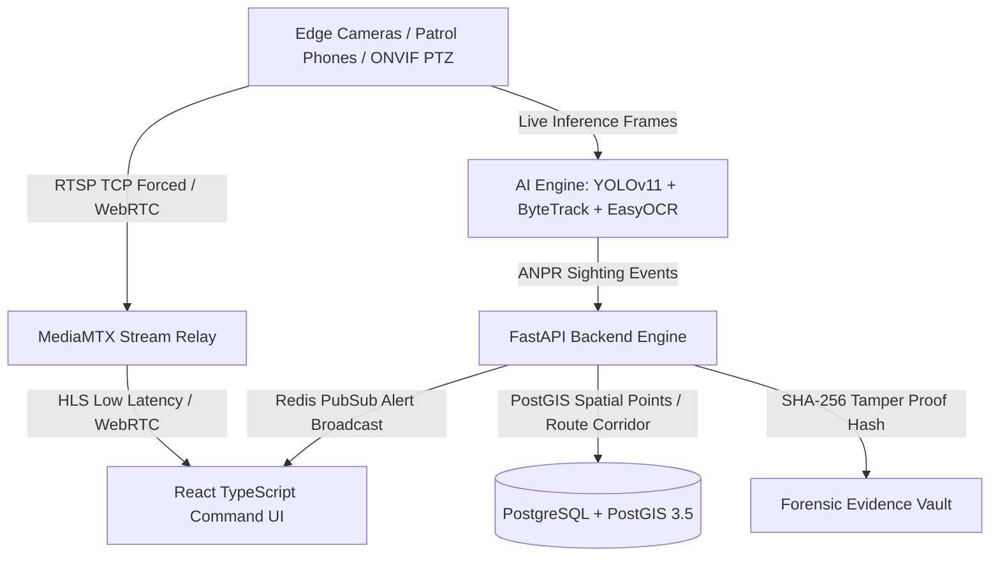

# 🛡️ SENTINEL GRID — Unified Federated Video Intelligence Platform

[](https://fastapi.tiangolo.com)
[](https://reactjs.org/)
[](https://www.typescriptlang.org/)
[](https://www.postgresql.org/)
[](https://postgis.net/)
[](https://github.com/ultralytics/ultralytics)
[](https://pytorch.org/)
[](https://tailwindcss.com/)
[](https://github.com/suryapratapworks/sentinel_grid/actions/workflows/ci.yml)

---

## 📌 Executive Summary

**SENTINEL GRID** is a decentralized, edge-native, federated video surveillance and vehicle intelligence platform designed for state security agencies, smart cities, highway authorities, and law enforcement.

It unifies thousands of heterogeneous, proprietary CCTV cameras (Milestone, Genetec, Hikvision, Dahua, CP Plus, Axis, and mobile patrol phones) into a single, low-latency, real-time investigative grid without requiring hardware replacement.

---

## 🏛️ 4-Tier Hybrid Architecture



---

## 🌟 The 4 Core Architectural Models

### 📍 Model 1: Central CCTV Registry & Tactical GIS Mapping
* **Unified Asset Inventory:** Maps state police, municipal, and highway CCTV nodes with full hardware telemetry.
* **PostGIS Spatial Indexing:** Real-time geospatial location queries and proximity analysis.
* **Super Admin Governance:** Strict RBAC preventing unauthorized camera modifications or deletions.

### 🧠 Model 2: Edge-Native AI ANPR & Vehicle Route Reconstruction
* **Neural Pipeline:** YOLOv11 vehicle bounding box detection &rarr; ByteTrack spatial track association &rarr; EasyOCR PyTorch text extraction.
* **Indian License Plate Normalization:** Regex parser with intelligent character disambiguation (e.g. `DL-01-AB-1234`).
* **Spatial-Temporal Corridor Reconstruction:** Uses Presentation Timestamps (PTS) to chronologically map vehicle flight paths across camera intersections.

### 🌐 Model 3: Federated Integration Hub
* **Multi-VMS Interoperability:** Custom translation adapters for Milestone XProtect, Genetec Security Center, HikCentral, and Dahua DSS.
* **Zero Hardware Rip-and-Replace:** Standardizes proprietary feeds into an open unified JSON/RTSP schema.

### 🛡️ Model 4: Cryptographic Forensic Evidence Locker
* **Tamper-Evident Chain of Custody:** Automatically locks video clips and snapshots with **SHA-256 cryptographic hashes**.
* **Courtroom Admissibility:** Proves digital integrity under evidentiary compliance standards.

---

## 🔑 Default Roles & Access Credentials

| Role | Username | Password | Privileges |
| :--- | :--- | :--- | :--- |
| **Super Admin** | `admin` | `admin123` | Full system control, camera deletion, VMS federation, evidence vault |
| **Crime Investigator** | `investigator` | `investigator123` | Vehicle search, route corridor reconstruction, evidence review |
| **Traffic Operator** | `operator` | `operator123` | Live GIS map, Video Wall Matrix, Watchlist monitoring |
| **Municipal Viewer** | `municipal_viewer` | `viewer123` | Read-only surveillance and traffic density overview |

---

## 🚀 Quickstart Guide

### Option A: Complete Docker Compose Deployment (Recommended)

Run the full production stack (PostGIS + Redis + MediaMTX + FastAPI + React/Nginx) with a single command:

```bash
# 1. Clone repository
git clone https://github.com/suryapratapworks/sentinel_grid.git
cd sentinel_grid

# 2. Configure environment
cp .env.example .env

# 3. Start services
docker compose up -d --build
```

Access the interfaces:
* **Command Center UI:** [http://localhost](http://localhost) (or [http://localhost:80](http://localhost:80))
* **FastAPI Gateway:** [http://localhost:8000](http://localhost:8000)
* **Interactive API Docs (Swagger):** [http://localhost:8000/docs](http://localhost:8000/docs)
* **MediaMTX HLS Gateway:** [http://localhost:8888](http://localhost:8888)
* **WebSocket Alert Stream:** `ws://localhost:8000/ws/alerts`

---

### Option B: Native Host Development Setup

#### Prerequisites
* Python 3.10+
* Node.js 18+
* PostgreSQL 16+ with PostGIS extension enabled
* Redis 7+

#### 1. Setup Backend
```bash
python -m venv venv

# Windows PowerShell:
.\venv\Scripts\Activate.ps1
# Linux / macOS:
source venv/bin/activate

pip install -r requirements.txt
cp .env.example .env
python setup_postgis.py
python -m uvicorn backend.app.main:app --host 0.0.0.0 --port 8000 --reload
```

#### 2. Setup Frontend
```bash
cd frontend
npm install
npm run dev
```

#### 3. Start MediaMTX Stream Relay
```bash
# Windows
bins/mediamtx/mediamtx.exe mediamtx/mediamtx.yml

# Linux
./bins/mediamtx/mediamtx mediamtx/mediamtx.yml
```

---

## 📱 Mobile Patrol Stream (Android / iOS)
Transform any smartphone into a live patrol ANPR sensor:
1. Install **IP Webcam** (Android) or **IP Camera Lite** (iOS).
2. Connect to the local Wi-Fi network and tap **Start server**.
3. In Sentinel Grid UI &rarr; **Central CCTV Registry** &rarr; Click **Onboard Camera** &rarr; Enter phone stream URL: `http://<PHONE_IP>:8080/video`.
4. Run live AI ANPR worker:
   ```bash
   python workers/anpr_worker.py --phone-ip <PHONE_IP>
   ```

---

## 🧪 Automated Test Suite
Run the full verification test suite:
```bash
pytest tests/test_sentinel.py -v
```

---

## 📄 License & Ownership
Developed for statewide smart city intelligence and national security operations.  
Maintained by **[suryapratapworks](https://github.com/suryapratapworks)**.
